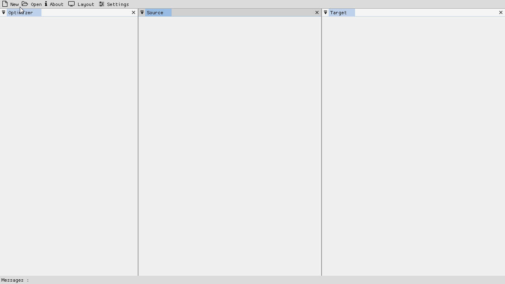
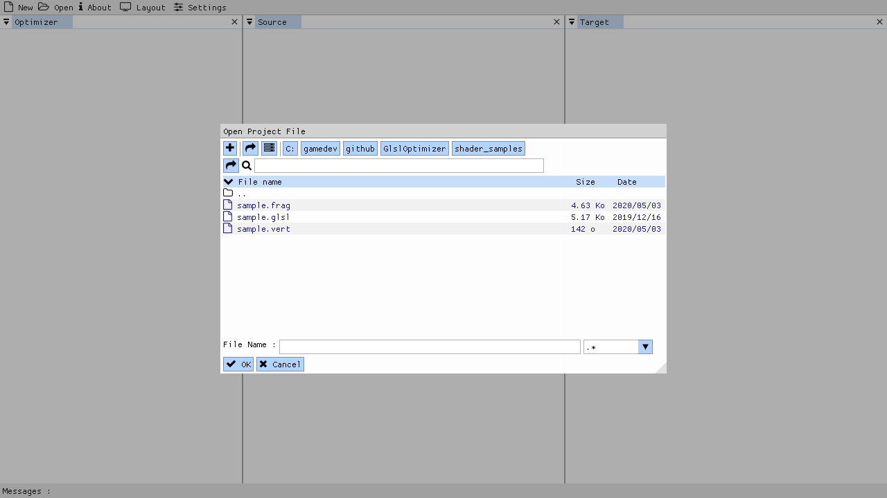
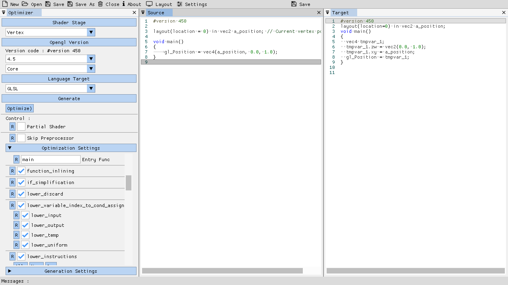
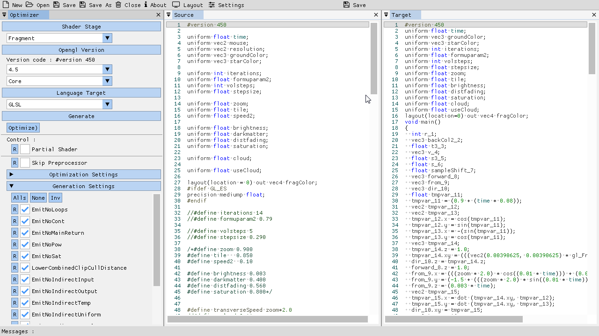
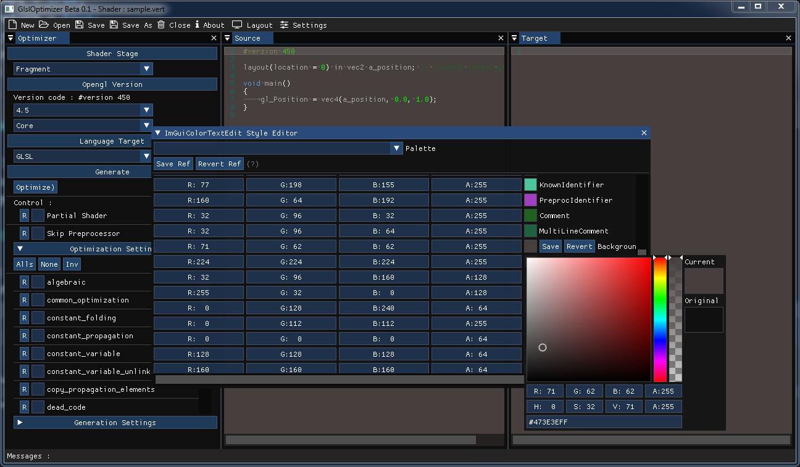

# GlslOptimizerV2

GlslOptimizerV2 is an optimizer for the glsl language with support of last opengl api and Stages 
Vertex \ Tesselation Control \ Tesselation Evaluation \ Geometry \ Fragment

Based on [Mesa3D](https://www.mesa3d.org/) and [glsl-optimizer](https://github.com/aras-p/glsl-optimizer)

## Why ?

Some time ago i found the original glsl-optimizer, but this project is stopped since a while and without support of Tesselation and Geometry shader stage nor last Opengl Api.

After analysed it a bit, i discovered than most of the Optimization code is coming from Mesa3D Implementation. 
So after a bit of search, i decided to create an updated version of Gsl-Optimizer who can support last stages and last Opengl api too.

All this work is mostly based on Mesa3D and original Glsl-Optimizer, but all not work porperly for the moment.
I not guaranty than generated optimized shader can compile

I have exposed the most of params i have found in Mesa3D for better optimization possibilities, and proposed a GlslOptimizer module and an standalone App for optimize in an easy way your shaders.

I am very interested in graphic programming but as a self-learning guy, im in no way an expert.

So if you feel like it, help me improve this Software that I make available in open source for that.

## Get started :

1) Open the App :)
2) Open a shader file( you have many samples in dir shader_samples) or create new (in the main menu bar)
3) Set the type of shader, The version of glsl you want, and Tune the parameters.
4) Optimize

 
 ### To note : 
 
 All the settings are saved in a conf file in the same directory of your shader file
 the conf file name the name and ext of your shader file with an extention conf :
 If you have a shader like : shader.frag => the conf file will be shader_frag.conf
 
 So for the next time, you just need to open your sahder file again, (dont opn conf file) and your settings will comming back :)
 
## The module GlslOptimizerV2 : 

The module GlslOptimizerV2 is inside the directory GlslOptimizerV2

There is a CMakeLists.txt file for link into your porject easily

## The Standalone App :

Some screenshots of the current app :

Open You file :

Write/open your code and optimzie it : (see in the pane, all the params i exepose)

Customize the style ( the default theme is light but you can also customize app theme avec editor palette)

## Library used :

* [Glfw - ZLIB](http://www.glfw.org/)
* [Dear ImGui - Docking/tables branch - MIT](https://github.com/ocornut/imgui)
* [Glad - MIT](https://github.com/Dav1dde/glad)
* [tinyxml2 - ZLIB](https://github.com/leethomason/tinyxml2)
* [ImGuiColorTextEdit - MIT](https://github.com/BalazsJako/ImGuiColorTextEdit)
* [dirent - MIT]( https://github.com/tronkko/dirent)
* [cTools - MIT](https://github.com/aiekick/cTools)
* [ImGuiFileDialog - MIT](https://github.com/aiekick/ImGuiFileDialog)

 ## Based on :
 
 * [Mesa3D - MIT] (https://www.mesa3d.org) (all the optimisation code come form it)
 * [glsl-optimizer - MIT](https://github.com/aras-p/glsl-optimizer) (glsl generation is based on it)
 
